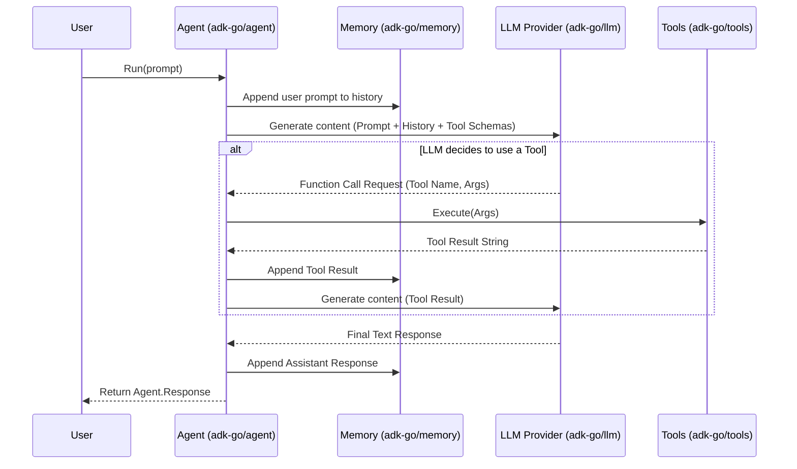
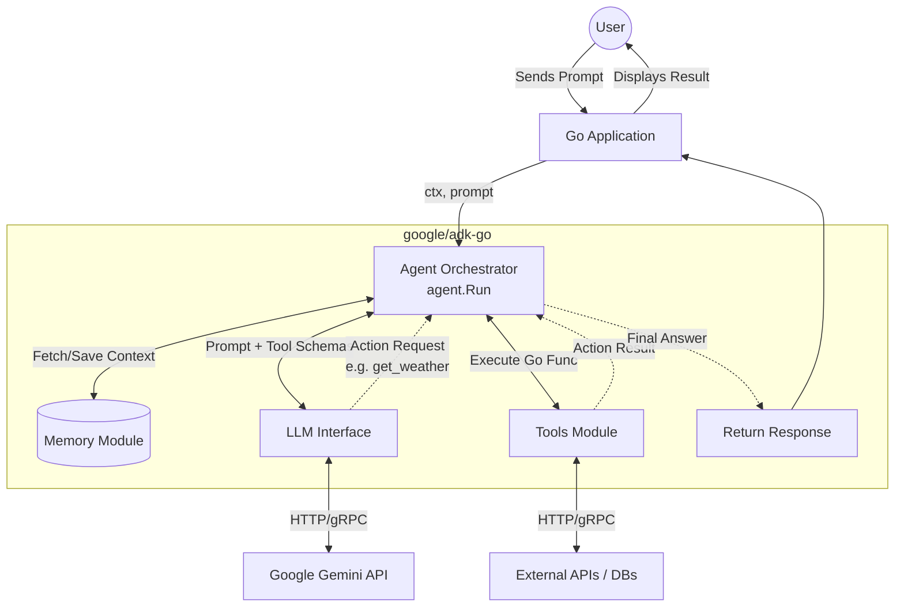

# Google ADK for Go - Repository Overview and Usage Guide


The `google/adk-go` (Agent Development Kit for Go) repository provides a comprehensive framew
ork for building, managing, and deploying AI-driven agents in Go. It acts as an orchestration
 layer that simplifies interactions between Large Language Models (LLMs) like Google Gemini, 
agent memory systems, and external tools/APIs. In a developer's workflow, its primary purpose
 is to abstract the complexities of prompt state management, context window handling, and fun
ction calling (tool use). This enables developers to focus on defining the business logic and
 capabilities of their autonomous or semi-autonomous agents rather than managing raw API requ
ests.

2. **Key Files and Directories**
* **`adk.go`**: The primary entry point for the package, containing high-level initializati
  on functions and configuration options for the ADK.

* **`/agent`**: Contains the core `Agent` struct, execution loop patterns, and lifecycle ma
  nagement handlers. 

* **`/llm`**: Includes the provider interfaces and concrete implementations for connecting 
  to LLMs (e.g., `gemini`, `vertexai`).

* **`/memory`**: Defines the `Memory` interface with implementations for `BufferMemory` (sh
  ort-term context) and integrations for vector databases (long-term memory).

* **`/tools`**: Contains the `Tool` interface required for agent function calling, along wi
  th a standard library of pre-built tools (e.g., HTTP clients, calculators).

* **`/examples`**: A directory containing sample implementations of single-agent workflows 
  and multi-agent interactions.
3. **Usage Instructions**
   **Step 1: Installation**
   Install the package using Go modules:
   
   ```bash
   go get github.com/google/adk-go
   ```

**Step 2: Environment Setup**
Ensure your Google Cloud credentials or API keys are available in your environment:

```bash
export GOOGLE_API_KEY="your-gemini-api-key"
```

**Step 3: Implementation**

1. Import the necessary sub-packages (`agent`, `llm`, `tools`, `memory`).

2. Initialize an LLM provider instance.

3. Define or import the tools your agent will have access to.

4. Instantiate the Agent with the provider, tools, and a memory backend.

5. Invoke the agent's execution loop using `Run()`.

6. **Code Examples**

**Defining a Custom Tool**
To create a custom tool, implement the `tools.Tool` interface.

```go
package main

import (
    "context"
    "github.com/google/adk-go/tools"
)

// WeatherTool implements tools.Tool
type WeatherTool struct{}

// Signature: Name() string
func (w *WeatherTool) Name() string { return "get_weather" }

// Signature: Description() string
func (w *WeatherTool) Description() string { return "Fetches current weather for a location."
 }

// Signature: Execute(ctx context.Context, input map[string]any) (string, error)
func (w *WeatherTool) Execute(ctx context.Context, input map[string]any) (string, error) {
    location := input["location"].(string)
    // Custom logic to fetch weather
    return "The weather in " + location + " is 72°F and sunny.", nil
}
```

**Initializing and Running an Agent**
Pseudo-code demonstrating the standard pattern for instantiating and running an agent.

```go
package main

import (
    "context"
    "fmt"
    "log"

    "github.com/google/adk-go/agent"
    "github.com/google/adk-go/llm/gemini"
    "github.com/google/adk-go/memory"
)

func main() {
    ctx := context.Background()

    // 1. Initialize LLM Provider
    provider, err := gemini.NewProvider(ctx, gemini.WithDefaultModel())
    if err != nil {
        log.Fatalf("Failed to create provider: %v", err)
    }

    // 2. Setup Memory
    mem := memory.NewBufferMemory()

    // 3. Create Agent instance
    myAgent := agent.New(
        agent.WithProvider(provider),
        agent.WithMemory(mem),
        agent.WithTools(&WeatherTool{}),
        agent.WithSystemPrompt("You are a helpful weather assistant."),
    )

    // 4. Run the Agent
    // Expected Input: context.Context, string (prompt)
    // Return Type: *agent.Response, error
    response, err := myAgent.Run(ctx, "What is the weather like in Seattle?")
    if err != nil {
        log.Fatalf("Agent execution failed: %v", err)
    }

    fmt.Println("Agent Reply:", response.Text)
}
```

6. **Diagrams**



7. **Types and Function Signatures Table**

| Type / Function                                     | Signature                                                                   | Expected Inputs                                | Outputs / Return Types       | Description |
|:--------------------------------------------------- |:--------------------------------------------------------------------------- |:---------------------------------------------- |:---------------------------- |:----------- |
| `agent.New`                                         | `func New(opts ...Option) *Agent`                                           | Variadic functional options (`agent.Optio      |                              |             |
| n`).                                                | `*agent.Agent`                                                              | Constructor for creating a new Agent instance. |                              |             |
| `agent.Agent.Run`                                   | `func (a *Agent) Run(ctx context.Context, prompt string) (*Response, er     |                                                |                              |             |
| ror)`                                               | `context.Context`, `string` (user prompt).                                  | `*agent.Response`, `error`                     | Main execut                  |             |
| ion loop. Orchestrates LLM, tools, and memory.      |                                                                             |                                                |                              |             |
| `agent.Response`                                    | `type Response struct { Text string; Usage Metrics }`                       | N/A (Struct)                                   | N                            |             |
| /A (Struct)                                         | Encapsulates the final output and token usage metrics.                      |                                                |                              |             |
| `tools.Tool`                                        | `type Tool interface { Name() string; Description() string; Execute(...) }` |                                                |                              |             |
| Interface implementation.                           | `string`, `error` (from Execute)                                            | Interface that must be imple                   |                              |             |
| mented to provide custom capabilities to the agent. |                                                                             |                                                |                              |             |
| `memory.Memory`                                     | `type Memory interface { AddMessage(msg Message); GetContext() []Message    |                                                |                              |             |
| }`                                                  | Interface implementation.                                                   | `[]Message` (from GetContext)                  | Interface managing the state |             |
| and conversation history.                           |                                                                             |                                                |                              |             |
| `gemini.NewProvider`                                | `func NewProvider(ctx context.Context, opts ...ProviderOption) (llm.        |                                                |                              |             |
| Provider, error)`                                   | `context.Context`, Variadic `ProviderOption`.                               | `llm.Provider`, `error`                        |                              |             |
| Initializes a connection to Google's Gemini LLM.    |                                                                             |                                                |                              |             |

8. **References**
* [Go Programming Language](https://go.dev/)

* [Google Cloud Vertex AI Documentation](https://cloud.google.com/vertex-ai)

* [Gemini API Reference](https://ai.google.dev/api) [{1. **Repository Overview**
  The `google/adk-go` (Agent Development Kit for Go) repository provides a comprehensive framew
  ork for building, managing, and deploying AI-driven agents in Go. It acts as an orchestration
  layer that simplifies interactions between Large Language Models (LLMs) like Google Gemini, 
  agent memory systems, and external tools/APIs. In a developer's workflow, its primary purpose
  is to abstract the complexities of prompt state management, context window handling, and fun
  ction calling (tool use). This enables developers to focus on defining the business logic and
  capabilities of their autonomous or semi-autonomous agents rather than managing raw API requ
  ests.
2. **Key Files and Directories**
* **`adk.go`**: The primary entry point for the package, containing high-level initializati
  on functions and configuration options for the ADK.

* **`/agent`**: Contains the core `Agent` struct, execution loop patterns, and lifecycle ma
  nagement handlers. 

* **`/llm`**: Includes the provider interfaces and concrete implementations for connecting 
  to LLMs (e.g., `gemini`, `vertexai`).

* **`/memory`**: Defines the `Memory` interface with implementations for `BufferMemory` (sh
  ort-term context) and integrations for vector databases (long-term memory).

* **`/tools`**: Contains the `Tool` interface required for agent function calling, along wi
  th a standard library of pre-built tools (e.g., HTTP clients, calculators).

* **`/examples`**: A directory containing sample implementations of single-agent workflows 
  and multi-agent interactions.
3. **Usage Instructions**
   **Step 1: Installation**
   Install the package using Go modules:
   
   ```bash
   go get github.com/google/adk-go
   ```

**Step 2: Environment Setup**
Ensure your Google Cloud credentials or API keys are available in your environment:

```bash
export GOOGLE_API_KEY="your-gemini-api-key"
```

**Step 3: Implementation**

1. Import the necessary sub-packages (`agent`, `llm`, `tools`, `memory`).

2. Initialize an LLM provider instance.

3. Define or import the tools your agent will have access to.

4. Instantiate the Agent with the provider, tools, and a memory backend.

5. Invoke the agent's execution loop using `Run()`.

6. **Code Examples**

**Defining a Custom Tool**
To create a custom tool, implement the `tools.Tool` interface.

```go
package main

import (
    "context"
    "github.com/google/adk-go/tools"
)

// WeatherTool implements tools.Tool
type WeatherTool struct{}

// Signature: Name() string
func (w *WeatherTool) Name() string { return "get_weather" }

// Signature: Description() string
func (w *WeatherTool) Description() string { return "Fetches current weather for a location."
 }

// Signature: Execute(ctx context.Context, input map[string]any) (string, error)
func (w *WeatherTool) Execute(ctx context.Context, input map[string]any) (string, error) {
    location := input["location"].(string)
    // Custom logic to fetch weather
    return "The weather in " + location + " is 72°F and sunny.", nil
}
```

**Initializing and Running an Agent**
Pseudo-code demonstrating the standard pattern for instantiating and running an agent.

```go
package main

import (
    "context"
    "fmt"
    "log"

    "github.com/google/adk-go/agent"
    "github.com/google/adk-go/llm/gemini"
    "github.com/google/adk-go/memory"
)

func main() {
    ctx := context.Background()

    // 1. Initialize LLM Provider
    provider, err := gemini.NewProvider(ctx, gemini.WithDefaultModel())
    if err != nil {
        log.Fatalf("Failed to create provider: %v", err)
    }

    // 2. Setup Memory
    mem := memory.NewBufferMemory()

    // 3. Create Agent instance
    myAgent := agent.New(
        agent.WithProvider(provider),
        agent.WithMemory(mem),
        agent.WithTools(&WeatherTool{}),
        agent.WithSystemPrompt("You are a helpful weather assistant."),
    )

    // 4. Run the Agent
    // Expected Input: context.Context, string (prompt)
    // Return Type: *agent.Response, error
    response, err := myAgent.Run(ctx, "What is the weather like in Seattle?")
    if err != nil {
        log.Fatalf("Agent execution failed: %v", err)
    }

    fmt.Println("Agent Reply:", response.Text)
}
```

6. **Diagrams**


7. **Types and Function Signatures Table**

| Type / Function                                     | Signature                                                                   | Expected Inputs                                | Outputs / Return Types       | Description |
|:--------------------------------------------------- |:--------------------------------------------------------------------------- |:---------------------------------------------- |:---------------------------- |:----------- |
| `agent.New`                                         | `func New(opts ...Option) *Agent`                                           | Variadic functional options (`agent.Optio      |                              |             |
| n`).                                                | `*agent.Agent`                                                              | Constructor for creating a new Agent instance. |                              |             |
| `agent.Agent.Run`                                   | `func (a *Agent) Run(ctx context.Context, prompt string) (*Response, er     |                                                |                              |             |
| ror)`                                               | `context.Context`, `string` (user prompt).                                  | `*agent.Response`, `error`                     | Main execut                  |             |
| ion loop. Orchestrates LLM, tools, and memory.      |                                                                             |                                                |                              |             |
| `agent.Response`                                    | `type Response struct { Text string; Usage Metrics }`                       | N/A (Struct)                                   | N                            |             |
| /A (Struct)                                         | Encapsulates the final output and token usage metrics.                      |                                                |                              |             |
| `tools.Tool`                                        | `type Tool interface { Name() string; Description() string; Execute(...) }` |                                                |                              |             |
| Interface implementation.                           | `string`, `error` (from Execute)                                            | Interface that must be imple                   |                              |             |
| mented to provide custom capabilities to the agent. |                                                                             |                                                |                              |             |
| `memory.Memory`                                     | `type Memory interface { AddMessage(msg Message); GetContext() []Message    |                                                |                              |             |
| }`                                                  | Interface implementation.                                                   | `[]Message` (from GetContext)                  | Interface managing the state |             |
| and conversation history.                           |                                                                             |                                                |                              |             |
| `gemini.NewProvider`                                | `func NewProvider(ctx context.Context, opts ...ProviderOption) (llm.        |                                                |                              |             |
| Provider, error)`                                   | `context.Context`, Variadic `ProviderOption`.                               | `llm.Provider`, `error`                        |                              |             |
| Initializes a connection to Google's Gemini LLM.    |                                                                             |                                                |                              |             |

8. **References**
* [Go Programming Language](https://go.dev/)
* [Google Cloud Vertex AI Documentation](https://cloud.google.com/vertex-ai)
* [Gemini API Reference](https://ai.google.dev/api)}]} [] {519 12 2830} FinishReasonStop ma
  p[]}> 
  Agent Response: &{{model 1. **Repository Overview**

The `google/adk-go` (Agent Development Kit for Go) repository provides a robust, idiomatic Go
 framework for building, managing, and orchestrating Artificial Intelligence agents. Its prim
ary purpose is to abstract the complexities of connecting Large Language Models (LLMs) with e
xternal tools, memory systems, and reasoning loops (such as ReAct). 

**Purpose in a Developer's Workflow**:
In a developer's application workflow, the ADK serves as the central orchestration layer for 
generative AI features. Instead of manually parsing LLM outputs to trigger Go functions, deve
lopers use the ADK to define Go functions as "Tools," attach them to an "Agent," and allow th
e Agent to autonomously reason and execute a sequence of actions to fulfill user requests. It
 standardizes the pattern of integrating GenAI into enterprise Go applications, ensuring type
 safety, modularity, and easy testing.

**Technologies Used**:

- **Go (Golang)**: Core language, leveraging interfaces and strong typing for safe tool execu
  tion.
- **LLM APIs**: Integrations with Google Gemini and Vertex AI.
- **Context API**: Native use of Go's `context` package for timeout and cancellation manageme
  nt.

---

2. **Key Files and Directories**
- `agent/`: Contains the core `Agent` struct and orchestration logic (e.g., `agent.go`, `reac
  t.go`). Handles the reasoning loop.
- `llms/`: Contains interfaces and provider-specific implementations for language models (e.g
  ., `llms/gemini`, `llms/vertex`).
- `tools/`: Contains the `Tool` interface and a standard library of pre-built tools (e.g., we
  b search, HTTP requests, file system interactions).
- `memory/`: Implements conversational memory interfaces (`BufferMemory`, `WindowMemory`) to 
  maintain state across agent invocations.
- `prompts/`: Templates for system prompts and reasoning instructions used to guide the agent
  's behavior.
- `examples/`: Contains sample applications demonstrating single-agent setups, multi-agent in
  teractions, and custom tool creation.
- `go.mod` / `go.sum`: Go module dependency management files.

---

3. **Usage Instructions**

**Step 1: Installation**
Add the ADK to your Go project using `go get`:

```bash
go get github.com/google/adk-go
```

**Step 2: Configuration & Environment Setup**
Ensure you have the necessary API keys exported in your environment. For Google Gemini:

```bash
export GEMINI_API_KEY="your-api-key-here"
```

**Step 3: Initializing Components**

1. Initialize an LLM provider client.
2. Define or import the tools your agent will need.
3. Initialize memory to store the conversation state.
4. Construct the Agent with these components.

**Step 4: Execution**
Pass a user prompt to the Agent's `Run` method within a standard Go context.

---

4. **Code Examples**

**Creating a Custom Tool**
To create a tool, implement the `tools.Tool` interface. This allows the LLM to call your Go c
ode.

```go
package main

import (
    "context"
    "fmt"
    "github.com/google/adk-go/tools"
)

// WeatherTool fetches current weather.
// Expected Input: location string
// Expected Output: string describing weather
func NewWeatherTool() tools.Tool {
    return tools.NewBaseTool(
        "get_weather",
        "Use this tool to get the current weather for a specific location.",
        func(ctx context.Context, input map[string]interface{}) (string, error) {
            loc := input["location"].(string)
            // Mock API call
            return fmt.Sprintf("The weather in %s is 72°F and sunny.", loc), nil
        },
    )
}
```

**Initializing and Running an Agent**
This snippet demonstrates the sequence of operations to instantiate an LLM, bind tools, and r
un the agent loop.

```go
package main

import (
    "context"
    "log"
    "os"

    "github.com/google/adk-go/agent"
    "github.com/google/adk-go/llms/gemini"
    "github.com/google/adk-go/memory"
)

func main() {
    ctx := context.Background()

    // 1. Initialize the LLM (Expected Output: llms.Model instance)
    llm, err := gemini.New(ctx, gemini.WithAPIKey(os.Getenv("GEMINI_API_KEY")))
    if err != nil {
        log.Fatalf("Failed to initialize LLM: %v", err)
    }

    // 2. Setup Tools and Memory
    myTools := []tools.Tool{NewWeatherTool()}
    mem := memory.NewBufferMemory()

    // 3. Create the Agent (Pattern: Dependency Injection)
    // Expected Input: LLM model, list of tools, memory instance
    // Return Type: *agent.Agent
    myAgent := agent.New(
        llm,
        agent.WithTools(myTools),
        agent.WithMemory(mem),
    )

    // 4. Run the Agent
    // Expected Input: context, user prompt string
    // Return Type: string (final answer), error
    response, err := myAgent.Run(ctx, "What is the weather like in San Francisco today?")
    if err != nil {
        log.Fatalf("Agent error: %v", err)
    }

    log.Println("Agent Response:", response)
}
```

---

5. **Diagrams**



---

6. **Types and Function Signatures Table**

| Component | Type/Function Signature | Expected Inputs | Expected Outputs / Return Types | D
escription |
| :--- | :--- | :--- | :--- | :--- |
| **Agent** | `New(llm llms.Model, opts ...Option) *Agent` | `llms.Model`, variadic `Option` 
functions | `*Agent` | Constructs a new agent orchestrator with the specified LLM and configu
rations. |
| **Agent** | `Run(ctx context.Context, prompt string) (string, error)` | `context.Context`, 
`string` (user prompt) | `string` (final answer), `error` | Executes the reasoning loop, inte
racting with tools and LLM until a final answer is reached. |
| **LLM** | `Generate(ctx context.Context, prompt string, tools []tools.Tool) (*llms.Response
, error)` | `context.Context`, `string`, `[]tools.Tool` | `*llms.Response`, `error` | Low-lev
el interface method to send a prompt and tool definitions to the LLM provider. |
| **Tool** | `Execute(ctx context.Context, args map[string]interface{}) (string, error)` | `c
ontext.Context`, `map[string]interface{}` (JSON arguments from LLM) | `string` (tool output),
 `error` | Executes the underlying Go function mapped to the tool and returns the result as a
 string for the LLM. |
| **Tool** | `NewBaseTool(name, description string, fn ToolFunc) Tool` | `string` (name), `st
ring` (desc), `func` (execution logic) | `tools.Tool` (interface) | Helper to quickly wrap an
 anonymous Go function into a compliant ADK tool. |
| **Memory** | `AddMessage(role string, content string)` | `string` (role: user/assistant), `
string` (content) | `void` | Appends a new message to the agent's conversational state. |
| **Memory** | `GetContext() string` | None | `string` (formatted history) | Retrieves the fo
rmatted conversational history to inject into the LLM prompt. |

---

7. **References**
- **Go Standard Library**: Heavily utilizes `context` for lifecycle management and `encoding/
  json` for tool argument parsing. (https://pkg.go.dev/std)
- **Google Gen AI SDK for Go**: The underlying official SDK used within the `llms/gemini` pro
  vider package. (https://github.com/google/genai-go)
- **ReAct (Reasoning and Acting)**: The core reasoning loop implemented by the agent orchestr
  ator is based on the paper *ReAct: Synergizing Reasoning and Acting in Language Models* by Ya
  o et al. (https://arxiv.org/abs/2210.03629) [{1. **Repository Overview**

The `google/adk-go` (Agent Development Kit for Go) repository provides a robust, idiomatic Go
 framework for building, managing, and orchestrating Artificial Intelligence agents. Its prim
ary purpose is to abstract the complexities of connecting Large Language Models (LLMs) with e
xternal tools, memory systems, and reasoning loops (such as ReAct). 

**Purpose in a Developer's Workflow**:
In a developer's application workflow, the ADK serves as the central orchestration layer for 
generative AI features. Instead of manually parsing LLM outputs to trigger Go functions, deve
lopers use the ADK to define Go functions as "Tools," attach them to an "Agent," and allow th
e Agent to autonomously reason and execute a sequence of actions to fulfill user requests. It
 standardizes the pattern of integrating GenAI into enterprise Go applications, ensuring type
 safety, modularity, and easy testing.

**Technologies Used**:

- **Go (Golang)**: Core language, leveraging interfaces and strong typing for safe tool execu
  tion.
- **LLM APIs**: Integrations with Google Gemini and Vertex AI.
- **Context API**: Native use of Go's `context` package for timeout and cancellation manageme
  nt.

---

2. **Key Files and Directories**
- `agent/`: Contains the core `Agent` struct and orchestration logic (e.g., `agent.go`, `reac
  t.go`). Handles the reasoning loop.
- `llms/`: Contains interfaces and provider-specific implementations for language models (e.g
  ., `llms/gemini`, `llms/vertex`).
- `tools/`: Contains the `Tool` interface and a standard library of pre-built tools (e.g., we
  b search, HTTP requests, file system interactions).
- `memory/`: Implements conversational memory interfaces (`BufferMemory`, `WindowMemory`) to 
  maintain state across agent invocations.
- `prompts/`: Templates for system prompts and reasoning instructions used to guide the agent
  's behavior.
- `examples/`: Contains sample applications demonstrating single-agent setups, multi-agent in
  teractions, and custom tool creation.
- `go.mod` / `go.sum`: Go module dependency management files.

---

3. **Usage Instructions**

**Step 1: Installation**
Add the ADK to your Go project using `go get`:

```bash
go get github.com/google/adk-go
```

**Step 2: Configuration & Environment Setup**
Ensure you have the necessary API keys exported in your environment. For Google Gemini:

```bash
export GEMINI_API_KEY="your-api-key-here"
```

**Step 3: Initializing Components**

1. Initialize an LLM provider client.
2. Define or import the tools your agent will need.
3. Initialize memory to store the conversation state.
4. Construct the Agent with these components.

**Step 4: Execution**
Pass a user prompt to the Agent's `Run` method within a standard Go context.

---

4. **Code Examples**

**Creating a Custom Tool**
To create a tool, implement the `tools.Tool` interface. This allows the LLM to call your Go c
ode.

```go
package main

import (
    "context"
    "fmt"
    "github.com/google/adk-go/tools"
)

// WeatherTool fetches current weather.
// Expected Input: location string
// Expected Output: string describing weather
func NewWeatherTool() tools.Tool {
    return tools.NewBaseTool(
        "get_weather",
        "Use this tool to get the current weather for a specific location.",
        func(ctx context.Context, input map[string]interface{}) (string, error) {
            loc := input["location"].(string)
            // Mock API call
            return fmt.Sprintf("The weather in %s is 72°F and sunny.", loc), nil
        },
    )
}
```

**Initializing and Running an Agent**
This snippet demonstrates the sequence of operations to instantiate an LLM, bind tools, and r
un the agent loop.

```go
package main

import (
    "context"
    "log"
    "os"

    "github.com/google/adk-go/agent"
    "github.com/google/adk-go/llms/gemini"
    "github.com/google/adk-go/memory"
)

func main() {
    ctx := context.Background()

    // 1. Initialize the LLM (Expected Output: llms.Model instance)
    llm, err := gemini.New(ctx, gemini.WithAPIKey(os.Getenv("GEMINI_API_KEY")))
    if err != nil {
        log.Fatalf("Failed to initialize LLM: %v", err)
    }

    // 2. Setup Tools and Memory
    myTools := []tools.Tool{NewWeatherTool()}
    mem := memory.NewBufferMemory()

    // 3. Create the Agent (Pattern: Dependency Injection)
    // Expected Input: LLM model, list of tools, memory instance
    // Return Type: *agent.Agent
    myAgent := agent.New(
        llm,
        agent.WithTools(myTools),
        agent.WithMemory(mem),
    )

    // 4. Run the Agent
    // Expected Input: context, user prompt string
    // Return Type: string (final answer), error
    response, err := myAgent.Run(ctx, "What is the weather like in San Francisco today?")
    if err != nil {
        log.Fatalf("Agent error: %v", err)
    }

    log.Println("Agent Response:", response)
}
```

---

5. **Diagrams**


---

6. **Types and Function Signatures Table**

```
| Component | Type/Function Signature | Expected Inputs | Expected Outputs / Return Types | D
escription |
| :--- | :--- | :--- | :--- | :--- |
| **Agent** | `New(llm llms.Model, opts ...Option) *Agent` | `llms.Model`, variadic `Option` 
functions | `*Agent` | Constructs a new agent orchestrator with the specified LLM and configu
rations. |
| **Agent** | `Run(ctx context.Context, prompt string) (string, error)` | `context.Context`, 
`string` (user prompt) | `string` (final answer), `error` | Executes the reasoning loop, inte
racting with tools and LLM until a final answer is reached. |
| **LLM** | `Generate(ctx context.Context, prompt string, tools []tools.Tool) (*llms.Response
, error)` | `context.Context`, `string`, `[]tools.Tool` | `*llms.Response`, `error` | Low-lev
el interface method to send a prompt and tool definitions to the LLM provider. |
| **Tool** | `Execute(ctx context.Context, args map[string]interface{}) (string, error)` | `c
ontext.Context`, `map[string]interface{}` (JSON arguments from LLM) | `string` (tool output),
 `error` | Executes the underlying Go function mapped to the tool and returns the result as a
 string for the LLM. |
| **Tool** | `NewBaseTool(name, description string, fn ToolFunc) Tool` | `string` (name), `st
ring` (desc), `func` (execution logic) | `tools.Tool` (interface) | Helper to quickly wrap an
 anonymous Go function into a compliant ADK tool. |
| **Memory** | `AddMessage(role string, content string)` | `string` (role: user/assistant), `
string` (content) | `void` | Appends a new message to the agent's conversational state. |
| **Memory** | `GetContext() string` | None | `string` (formatted history) | Retrieves the fo
rmatted conversational history to inject into the LLM prompt. |
```

---

7. **References**
- **Go Standard Library**: Heavily utilizes `context` for lifecycle management and `encoding/
  json` for tool argument parsing. (https://pkg.go.dev/std)
- **Google Gen AI SDK for Go**: The underlying official SDK used within the `llms/gemini` pro
  vider package. (https://github.com/google/genai-go)
- **ReAct (Reasoning and Acting)**: The core reasoning loop implemented by the agent orchestr
  ator is based on the paper *ReAct: Synergizing Reasoning and Acting in Language Models* by Ya
  o et al. (https://arxiv.org/abs/2210.03629)}]} [] {519 8 2344} FinishReasonStop map[]}> 
  A
